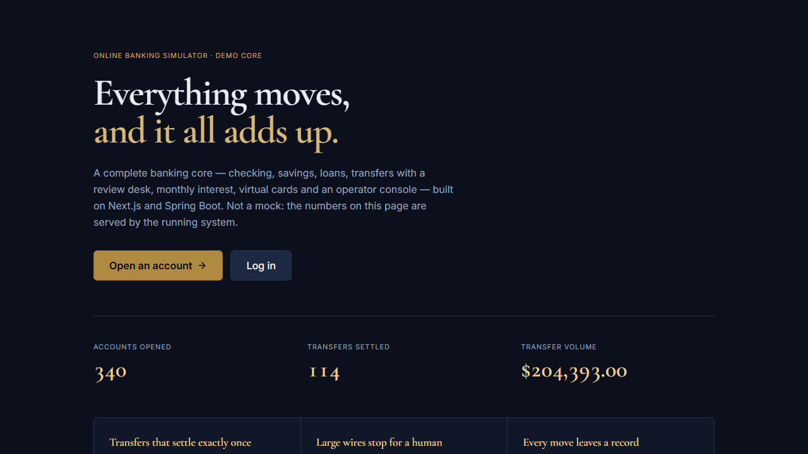
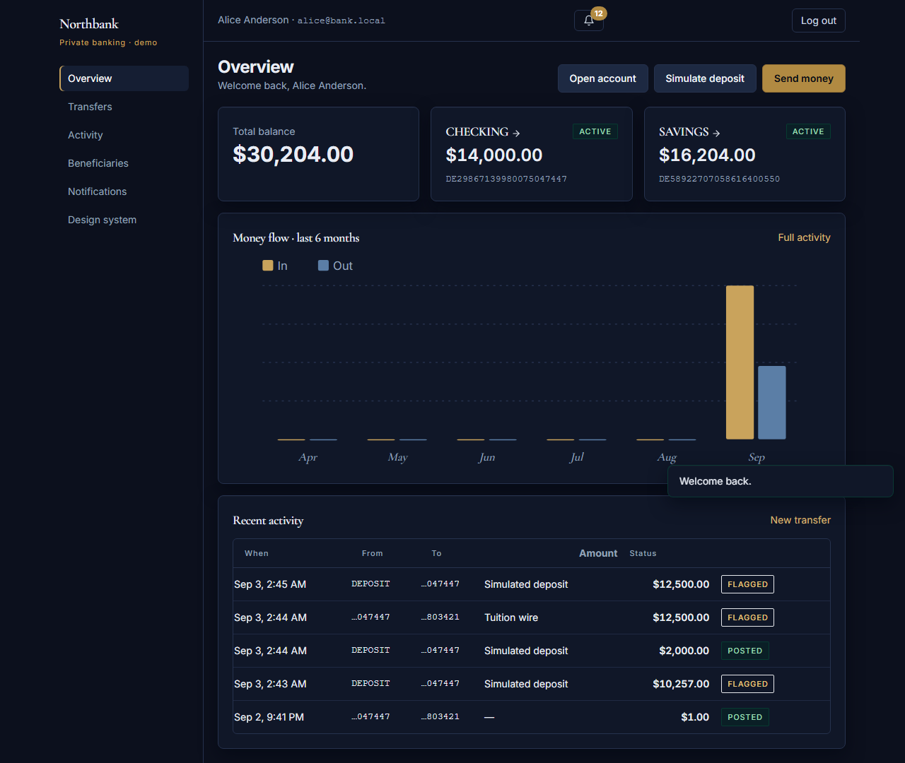
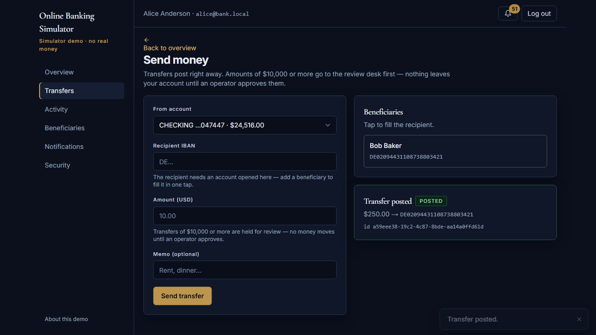
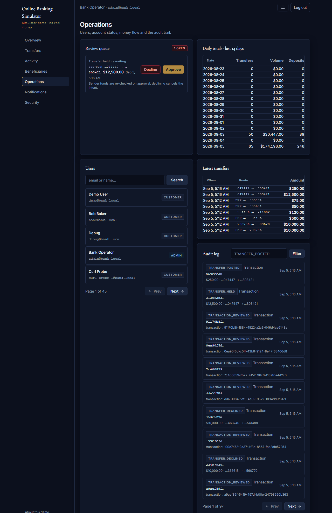
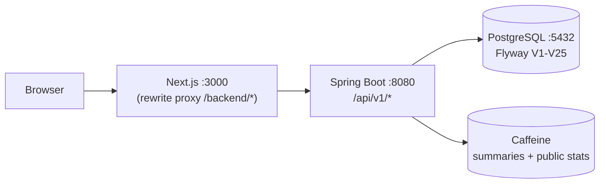

# Online Banking Simulator

A full-stack demo of a banking core: **Next.js + TypeScript** frontend,
**Java 17 + Spring Boot 4** backend, **PostgreSQL 16** database. It simulates
real money-movement semantics - atomic transfers, idempotency keys, interest
accrual, an operator review queue, audit trails - without inventing a fake
bank brand or touching real money.

| | |
|---|---|
|  |  |
|  |  |

These are captures of the running product, taken by
[frontend/e2e-screenshots/screenshots.spec.ts](frontend/e2e-screenshots/screenshots.spec.ts)
against the exact stack `start-all.ps1` + `seed-demo.ps1` boot - the wire in
the ops queue is a real threshold-triggered hold, not a prop.

## What it does

- **Accounts** - open CHECKING / SAVINGS / LOAN, simulated deposit rail, pessimistic-lock transfers
- **Money movement** - idempotent transfers (keys scoped per sender account), beneficiaries address book, paged history, CSV + PDF statements
- **Review queue** - transfers at/above the threshold never settle on submit: they stay HELD until an operator approves (money moves) or declines (nothing ever moved); flagged deposits credit on arrival and just need acknowledging
- **Interest engine** - deterministic, resumable per account/period job: savings earn actual/365 interest on each day's closing principal, loans are charged simple monthly interest on tracked principal only - never capped at the credit limit, so a maxed loan is charged, not forgiven; scheduler and admin share one implementation
- **Virtual cards** - Luhn-valid issuance, show-once PAN, freeze/unfreeze (tokenization-lite: hashes + last4)
- **Auth** - purpose-separated JWT tokens (access vs MFA challenge; pinned HS256, iss/aud/purpose), rotating refresh tokens with atomic rotation + reuse/family-burn detection, TOTP two-factor end to end (Security page setup + `/login/mfa` challenge) with persisted single-use challenges + per-account verification throttling, login rate limiting (socket-IP keys unless a trusted proxy is configured), BCrypt(12)
- **Notifications** - in-app center + unread badge, email stub wired into every money event
- **Ops console** - user search, freeze/unfreeze, review queue with Approve/Decline, daily totals, audit viewer
- **Security posture** - RBAC, security headers, locked CORS, RFC-7807 errors on every path, `X-Request-Id` correlation, documented residual risks
- **Design system** - a public [gallery](/design) of the shared primitives; the palette is enforced by `frontend/scripts/check-design-tokens.mjs`, so default Tailwind hues and raw hex literals cannot leak back in
- **About this demo** - a public [/about](/about) page that explains what is simulated and what is real, in plain words

## Architecture



Money is `NUMERIC(19,4)` in Postgres, `BigDecimal` in Java, and **strings** in
JSON - floats never touch currency. Every mutation writes an `audit_logs` row.

## Run it locally (no Docker)

```powershell
.\start-all.ps1     # Postgres (user-mode) + backend :8080 + frontend :3000, waits for real health
.\seed-demo.ps1     # alice/bob users, funded accounts, a HELD $12,500 wire for the review queue
```

Open http://localhost:3000 - register, or log in with the seeded users
(`alice@bank.local` / `bob@bank.local`, password `secret123`).
Operators: `admin@bank.local` / `change-me-admin-123` → **Operations** in the sidebar.

## API cheatsheet

| Method & path | Auth | Description |
|---|---|---|
| `POST /api/v1/auth/register` | open | Register, auto-opens a CHECKING account |
| `POST /api/v1/auth/login` | open (rate-limited) | JWT access token (15 min) + refresh cookie |
| `POST /api/v1/auth/refresh` · `logout` | cookie | Rotate / revoke the refresh family |
| `POST /api/v1/auth/totp/*`, `mfa/verify` | user | TOTP setup/enable/disable, 2FA login challenge |
| `GET /api/v1/auth/me` | user | Current profile |
| `GET /api/v1/accounts` · `POST /api/v1/accounts` | user | List / open (CHECKING, SAVINGS, LOAN) |
| `POST /api/v1/accounts/{id}/deposit` | owner | Simulated deposit rail, capped + flagged at the threshold |
| `POST /api/v1/transfers` (+`Idempotency-Key`) | owner | Atomic transfer; ≥$10k returns HELD for operator review |
| `GET /api/v1/transfers/{id}` | owner | Authorized operation detail backing the durable receipt route |
| `GET /api/v1/operations?key=` | owner | Resolve your own unresolved operation by idempotency key |
| `GET /api/v1/transactions?accountId=&cursor=` | owner | Keyset-paged history, date filters (no OFFSET) |
| `GET /api/v1/accounts/{id}/statement.csv` (.pdf) | owner | Dated statements (bounded windows) |
| `GET /api/v1/accounts/{id}/summary?months=` | owner | Monthly inflow/outflow (cached after authorization) |
| `GET/POST /api/v1/beneficiaries` | user | Address book (mod-97 validated IBANs) |
| `*/api/v1/accounts/{id}/cards*` | owner | Issue (show-once PAN), list masked, freeze |
| `GET /api/v1/notifications*` | user | Center, unread-count, mark-read |
| `GET /api/public/stats` | open | Landing hero: users, transfers, volume (cached) |
| `GET /api/v1/admin/users|transactions|audit-logs` | ADMIN | Ops search + filtered review queue |
| `POST /api/v1/admin/accounts/{id}/freeze|unfreeze` | ADMIN | Blocks transfers + deposits |
| `POST /api/v1/admin/transactions/{id}/review` | ADMIN | Approve a HELD transfer / acknowledge a flagged deposit |
| `POST /api/v1/admin/transactions/{id}/decline` | ADMIN | Cancel a HELD transfer (no money ever moves) |
| `POST /api/v1/admin/interest/run` | ADMIN | Trigger the monthly job on demand |
| `GET /api/v1/admin/reports/daily-totals` | ADMIN | Per-day volumes |
| `GET /api/v1/admin/reconciliation` | ADMIN | Projection-vs-journal drift report (never auto-repairs) |
| `GET/POST /api/v1/admin/email-outbox` | ADMIN | List / requeue dead-lettered outbox rows |
| `GET /api/v1/admin/kind-review` | ADMIN | Quarantine of migrations' uncertain kind classifications |

Errors follow RFC-7807 (`type/title/status/detail`), and every response carries
`X-Request-Id` for log correlation. The contract lives at `frontend/openapi.json`
(CI fails if code and spec drift apart) and drives the generated TS types.

## Verify it

```powershell
Set-Location backend; .\mvnw.cmd verify     # 176 tests + JaCoCo gate (H2 in PG mode)
# Real-PostgreSQL ITs (CI runs them against job-scoped Postgres services;
# locally, create a throwaway database first - never run these against your
# working bankdb):
#   psql -U postgres -c "CREATE DATABASE pf_it"
.\mvnw.cmd test "-Dtest=TransferConcurrencyIT" `
  "-Dspring.datasource.url=jdbc:postgresql://localhost:5432/pf_it" `
  "-Dspring.datasource.username=postgres" `
  "-Dspring.datasource.password=postgres" `
  "-Dspring.datasource.driver-class-name=org.postgresql.Driver"
# ...and the journal/migration suites (see docs/devops-ci.md): JournalCutoverIT,
# JournalReconciliationIT, and TransactionKindMigrationIT use the same shape
# (the cutover IT adds -Dit.pg.url/-Dit.pg.user/-Dit.pg.password).
Set-Location ..\frontend
npm run lint
npm test                                    # 98 tests: lib units + RTL component suite
npx playwright test                         # boots its own fresh build on :3000 and fails loudly if the port is busy (no stale-app testing); an ephemeral stack runs via E2E_BASE_URL; the silent-refresh specs additionally need a short-TTL backend + E2E_ACCESS_TTL_SECONDS (CI sets both)
npm run build
# README screenshots (requires the seeded stack; kept out of CI by design):
npx playwright test --config=playwright.screenshots.config.ts
```

CI (`.github/workflows/ci.yml`) runs eight jobs: backend verify (+ the
`TransactionKindMigrationIT` chain step) → frontend lint/test/build + smoke
e2e → docker compose build → OpenAPI contract drift against a Postgres
service → **concurrency-postgres** (the 24-transfer proof against a real
PostgreSQL service) → **cutover-postgres** (JournalCutoverIT: the V22
reconciled-journal cutover over a fresh PG schema) → **journal-postgres**
(JournalReconciliationIT: append-only triggers, duplicate-journal rejection,
corruption reporting on real PG) → **banking-e2e**: boots the real backend +
PostgreSQL and drives register → deposit → transfer → receipt through a real
browser. Dependabot watches npm, maven, docker, and the actions themselves.

Production-like stack (CI / servers): `docker compose up --build` → :3000; the
backend publishes no host port and is reached only through the Next.js proxy.

## How it was built

Ten parts, each independently runnable and verified live against real Postgres -
see [docs/roadmap-10-parts.md](docs/roadmap-10-parts.md), plus the 1.1.0-1.3.0
audit passes ([changelog](CHANGELOG.md)). Supporting docs:
[architecture](docs/architecture.md), [security review](docs/security-review.md),
[testing & CI](docs/devops-ci.md), [2-minute demo](docs/DEMO.md).

## Highlights

- A banking monolith (Next.js 16 + Spring Boot 4 + PostgreSQL 16) with atomic,
  idempotent money movement, an operator review queue, and full audit trails
- A 25-version Flyway schema (V1-V25: seven Java migrations - unnamed-CHECK
  retirement, loan-balance checks, idempotency-key scoping, the one-loan
  partial index, operation identity, the reconciled journal + cutover, loan
  principal/interest accruals, and evidence-backed kind classification)
- Auth hardened with rotating refresh tokens (atomic rotation + reuse
  detection), TOTP 2FA with per-account verification throttling, JWT with
  verified issuer/audience, RBAC, per-client-IP rate limiting, an access-token
  cookie that dies with its JWT, and security headers; residual risks documented
- CI with a contract-drift gate (OpenAPI vs code), an authenticated full-stack
  Playwright job against real PostgreSQL, and JaCoCo coverage gates
- Ledger integrity proven under load: a 24-way parallel-transfer test on real
  PostgreSQL conserves every cent, with idempotent replays posting exactly once
- A bespoke "private-bank ink" interface (custom ink/brass palette, serif
  display type, statement-style tables) instead of a stock dashboard theme
