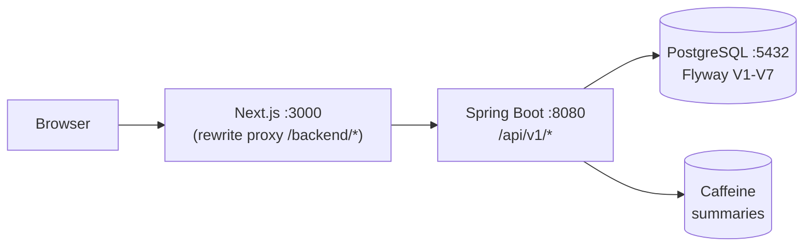

# Northbank - Enterprise Banking Platform

A full-fledged banking system built as a 10-part series: **Next.js + TypeScript** frontend,
**Java 17 + Spring Boot 3** backend, **PostgreSQL 16** database. Real money-movement semantics -
atomic transfers, idempotency keys, interest accrual, audit trails - not a CRUD demo wearing a suit.

## What it does

- **Accounts** - open CHECKING / SAVINGS / LOAN, simulated deposit rail, pessimistic-lock transfers
- **Money movement** - idempotent transfers, beneficiaries address book, paged history, CSV + PDF statements
- **Interest engine** - monthly job (savings earn, loans charged), idempotent per month, admin-triggerable
- **Virtual cards** - Luhn-valid issuance, show-once PAN, freeze/unfreeze (tokenization-lite: hashes + last4)
- **Notifications** - in-app center + unread badge, email stub wired into every money event
- **Ops console** - user search, freeze/unfreeze, flagged-transfer review queue, daily totals, audit viewer
- **Security** - JWT auth, RBAC, login rate limiting, security headers, locked CORS, BCrypt(12)

## Architecture



Money is `NUMERIC(19,4)` in Postgres, `BigDecimal` in Java, and **strings** in JSON -
floats never touch currency. Every mutation writes an `audit_logs` row.

## Run it locally (no Docker)

```powershell
.\start-all.ps1     # Postgres (user-mode) + backend :8080 + frontend :3000
.\seed-demo.ps1     # alice/bob users, $1000 deposit, $250 transfer
```

Open http://localhost:3000 - register, or log in with the seeded users
(`alice@bank.local` / `bob@bank.local`, password `secret123`).
Operators: `admin@bank.local` / `change-me-admin-123` → **Operations** in the sidebar.

## API cheatsheet

| Method & path | Auth | Description |
|---|---|---|
| `POST /api/v1/auth/register` | open | Register, auto-opens a CHECKING account |
| `POST /api/v1/auth/login` | open (rate-limited) | JWT access token (15 min) |
| `GET /api/v1/auth/me` | user | Current profile |
| `GET /api/v1/accounts` · `POST /api/v1/accounts` | user | List / open (CHECKING, SAVINGS, LOAN) |
| `POST /api/v1/accounts/{id}/deposit` | owner | Simulated deposit rail |
| `POST /api/v1/transfers` (+`Idempotency-Key`) | owner | Atomic transfer, ≥$10k auto-flagged |
| `GET /api/v1/transactions?accountId=` | owner | Paged history, date filters |
| `GET /api/v1/accounts/{id}/statement.csv` (.pdf) | owner | Dated statements |
| `GET /api/v1/accounts/{id}/summary?months=` | owner | Monthly inflow/outflow (cached) |
| `GET/POST /api/v1/beneficiaries` | user | Address book |
| `*/api/v1/accounts/{id}/cards*` | owner | Issue (show-once PAN), list masked, freeze |
| `GET /api/v1/notifications*` | user | Center, unread-count, mark-read |
| `GET /api/v1/admin/users|transactions|audit-logs` | ADMIN | Ops search + filtered review queue |
| `POST /api/v1/admin/accounts/{id}/freeze|unfreeze` | ADMIN | Blocks transfers + deposits |
| `POST /api/v1/admin/transactions/{id}/review` | ADMIN | Clears the flag queue |
| `POST /api/v1/admin/interest/run` | ADMIN | Trigger the monthly job on demand |
| `GET /api/v1/admin/reports/daily-totals` | ADMIN | Per-day volumes |

Errors follow RFC-7807 (`type/title/status/detail`), and every response carries
`X-Request-Id` for log correlation.

## Verify it

```powershell
Set-Location backend; .\mvnw.cmd verify    # 14 tests + JaCoCo gate (H2 in PG mode)
Set-Location ..\frontend; npm run lint; npm test; npx playwright test; npm run build
```

Production-like stack (CI / servers): `docker compose up --build` → :3000 → :8080 → :5432.

## How it was built

Ten parts, each independently runnable and verified live against real Postgres -
see [docs/roadmap-10-parts.md](docs/roadmap-10-parts.md). Supporting docs:
[architecture](docs/architecture.md), [security review](docs/security-review.md),
[testing & CI](docs/devops-ci.md), [2-minute demo](docs/DEMO.md).

## Resume bullets

- Built an enterprise-style banking monolith (Next.js 14 + Spring Boot 3 + PostgreSQL 16)
  with atomic, idempotent money movement and full audit trails
- Designed a 7-migration Flyway schema incl. a Java migration that retires an unnamed
  CHECK constraint portably across PostgreSQL and H2
- Hardened auth with JWT, RBAC, rate limiting, and security headers; documented residual
  risks in a published security review
- Shipped CI (backend verify + frontend lint/test/build + Playwright + Docker builds)
  with JaCoCo coverage gates
